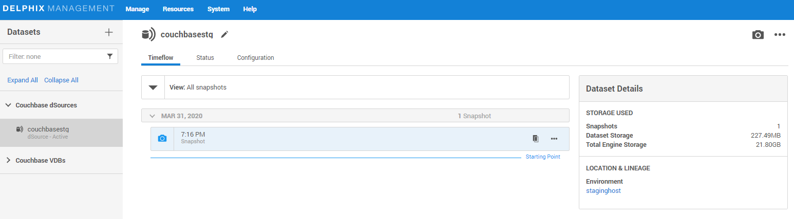

#  Provision VDB

[Purpose](#purpose)

[Prerequisites](#prerequisites)

[Provision VDB](#provision-vdb)

 
Purpose
=======

Virtual databases are a virtualized copies of dSource. 

Prerequisites
=============

-   Required a linked dSource from a source host

-   Added compatible target environment on Delphix enging

Provision VDB
=============

1. Click on the icon

2. Select the target host from dropdown and 

3. Enter the values as below in target configuration
- `Target Port Number`: Port number to start services
- `Mount Path`: NFS mount path where dSource snapshot will be mounted by engine
- `Target Cluster name`: Cluster name you would like Delphix to setup on your target host.
- `Cluster Ram Size`
- `Cluster Index Ram Size`
- `Cluster FTS Ram Size`
- `Cluster Eventing Ram Size`
- `Cluster Analytics Ram Size`
- `Target couchbase Admin User`
- `Target couchbase Admin password`

4. Provision vFiles: Add vdb name and target group

5. No need to add Policies, just press Next button

6. No need to add Masking, just press Next button

7. No need to add Hooks, just press Next button

8. Preview the summary and submit 

9. Once VDB is created successfully, you can review the datasets on Manage > Datasets > vdb Name.
