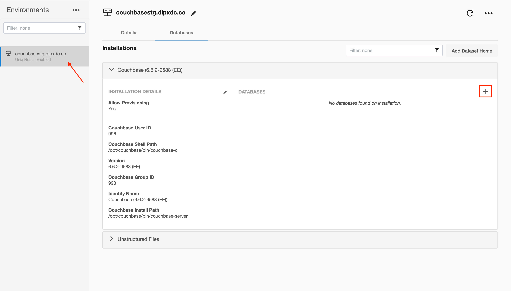
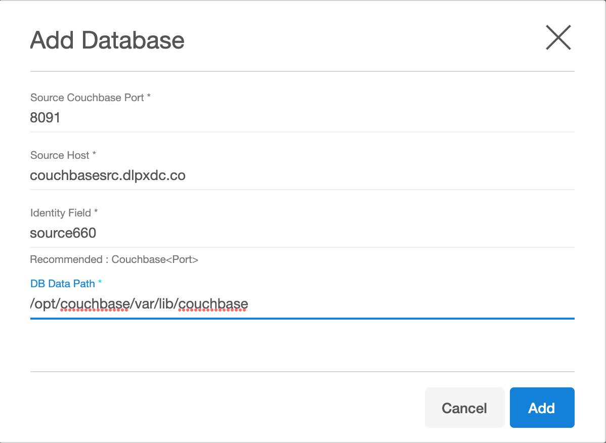
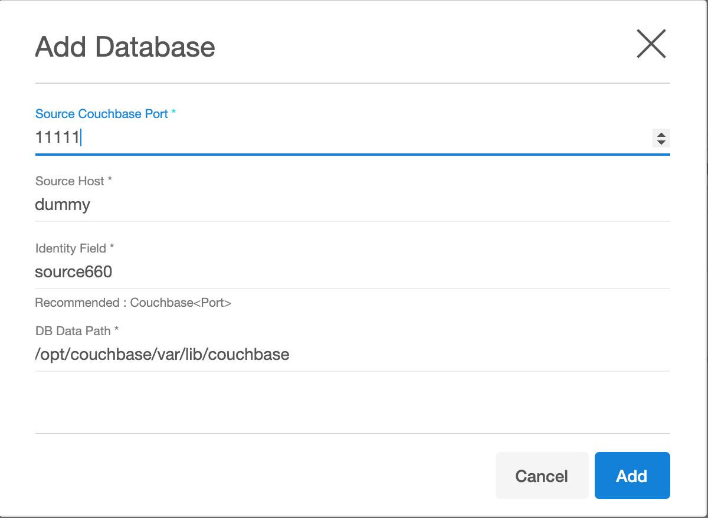

# Discovery

Environment discovery is a process that enables the Couchbase Plugin to determine Couchbase installation details on a host. Database discovery is initiated during the environment set up process
. Whenever there is any change (installing a new database home) to an already set up environment in the Delphix application, we need to perform an environment refresh. 

## Prerequisites

-   A stagine or target environment must be added to the Delphix Engine.
-   Installation of the Couchbase Plugin is required before the Discovery. 
-   Environment variable `$COUCHBASE_PATH ` should set on staging/target host, which contains the binary path of Couchbase.

### Configuring a staging environment 

Environments contain repositories, and each environment may have any number of repositories associated with it.
Couchbase is limiting number of Couchbase binaries installed on server to one, and in that case each environment will contain
a single repository with current Couchbase installation.

Repository contains database instances and in each repository any number of source cluster can be configured.
Please keep in mind that only one dSource can be enabled simiultaniusly on a given staging server.

For next step go to XDCR Setup or Backup Setup sections below

### XDCR Setup

By default Couchbase cluster are not discovered and has to be added manually using the following steps:

1. Login to the **Delphix Management** application.
2. Click **Manage**.
3. Select **Environments**.
4. Select the repository.
5. Click on **+** icon (Shown in next image).

6. Add required details in the `Add database` section.
 - Enter port number in **Source Couchbase port** section.
 - Enter source host address in section **Source Host** ( this will be used as Source cluster for XDCR replication )
 - Enter unique name for the staging database in **identify field** section.
 - Enter Couchbase data path of staging host in **DB data path** section.

### Backup Setup

By default Couchbase clusters are not discovered and has to be added manually using the following steps:

1. Login to the **Delphix Management** application.
2. Click **Manage**.
3. Select **Environments**.
4. Select the repository.
5. Click on **+** icon (Shown in next image).

6. Add required details in the `Add database` section.
 - Enter port number in **Source Couchbase port** section ( this can be any dummy number - this field is not used for backup based ingestion )
 - Enter source host address in section **Source Host** ( this can be any dummy number - this field is not used for backup based ingestion )
 - Enter unique name for the staging database in **identify field** section.
 - Enter Couchbase data path of staging host in **DB data path** section.

## Refreshing an Environment
Environment refresh will update the metadata associated with that environment and send a new Plugin to the host.

1. Login to the **Delphix Management** application.
2. Click **Manage**.
3. Select **Environments**.
4. In the Environments panel, click the name of the environment you want to refresh.
5. Select the **Refresh** icon.
6. In the Refresh confirmation dialog select **Refresh**.

