# Linking

Linking a data source will create a dSource object on the engine and allow Delphix to ingest data from this source. The dSource is an object that the Delphix Virtualization Engine uses to create and update virtual copies of your database. 


## Prerequisites

Staging environment created and source database configured in discovered repository

## Creating dSource using XDCR

1. Login to **Delphix Management** application.
2. Click **Manage** >  **Datasets**.
3. Select **Add dSource**.
4. In the Add dSource wizard, select the Couchbase source configuration which is created on the staging host.
5. Enter the Couchbase-specific parameters for your dSource configuration.
6. Select the dSource type XDCR from the drop-down available on dSource wizard.
7. Based on approach selection, follow the steps either for XDCR or Couchbase Backup Manager method. The Description of both methods is below.
8. Enter the details for **Staging Couchbase host** - FQDN or IP address recommended.
9. Enter the details for **Staging Port Number** available on the staging host. The default port for couchbase is 8091.
10. Enter the details for **Mount Path** available on the staging host. This empty folder acts as a base for NFS mounts.
11. Enter the details for **Staging Cluster Name** to setup new cluster on the staging host.
12. Enter the configuration details for your staging cluster as per resource availability on the staging host.
    - Cluster RAM Size
    - Cluster Index RAM Size
    - Cluster FTS RAM Size
    - Cluster Eventing RAM Size - this should be 0
    - Cluster Analysis RAM Size - this should be 0    

    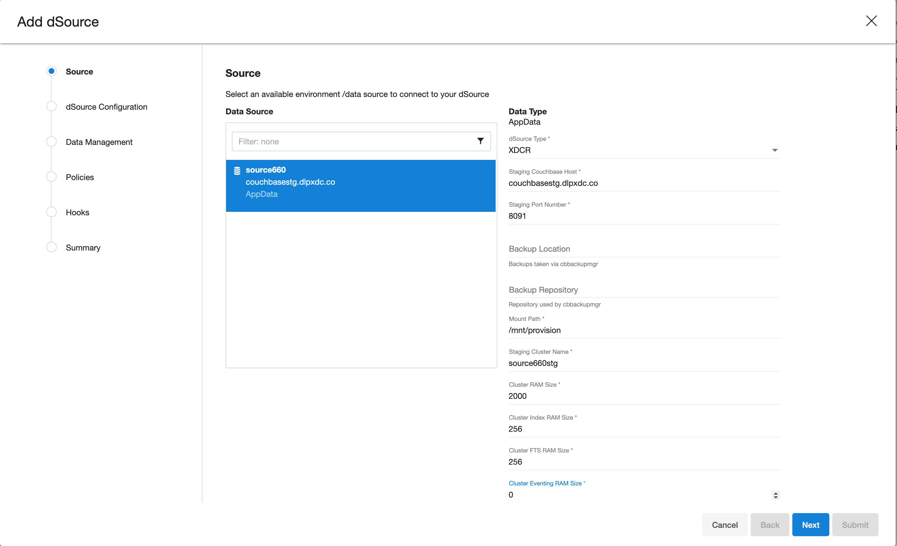

13. Configure the bucket size as an array.
    - If "bucket_name" is set to "*", and "bucket_size" is assigned a numeric value, all buckets should be configured with the specified size.
    - When both "bucket_name" and "bucket_size" are provided with specific values, individual buckets should be configured according to the corresponding values.

      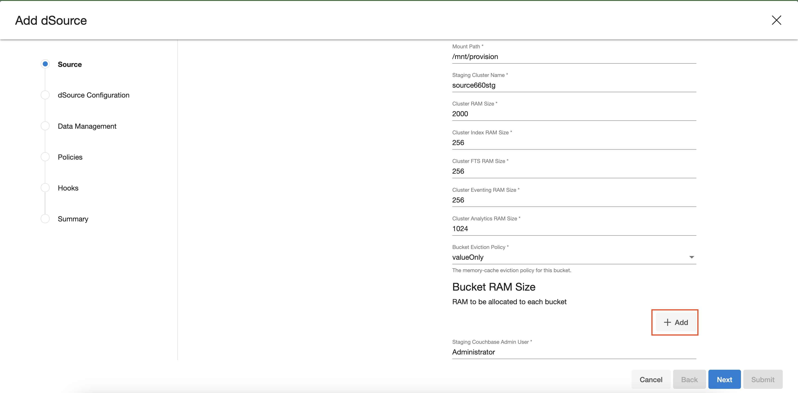
    
14. Enter the details of **Bucket Name** and **Bucket Size (in MB)**. Size must be greater than or equals to 100MB. 

    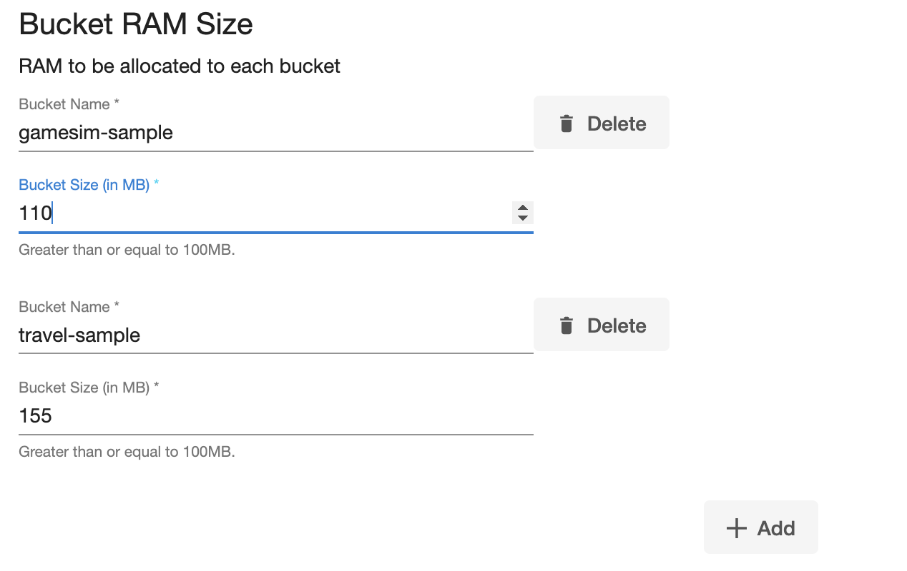

15. Enter the details for **Staging Cluster Admin User**  and **Staging Cluster Admin Password**
16. Enter the details for **Source Cluster Admin User**  and **Source Cluster Admin Password**

    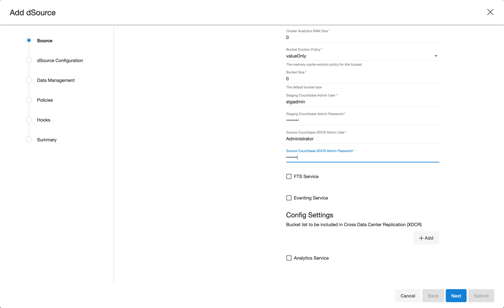

17. If not all buckets needs to be replicated, click on **+** plus symbol to modify configuration settings. Mention bucket list for which cross datacenter replication (XDCR) only be enabled.  
    

18. Enter the details of **Bucket Name** to be part of XDCR. Then click on **Next** button  
    

19. Provide the details for **dSource Name** and **Target group** on the dSource configuration page.  
    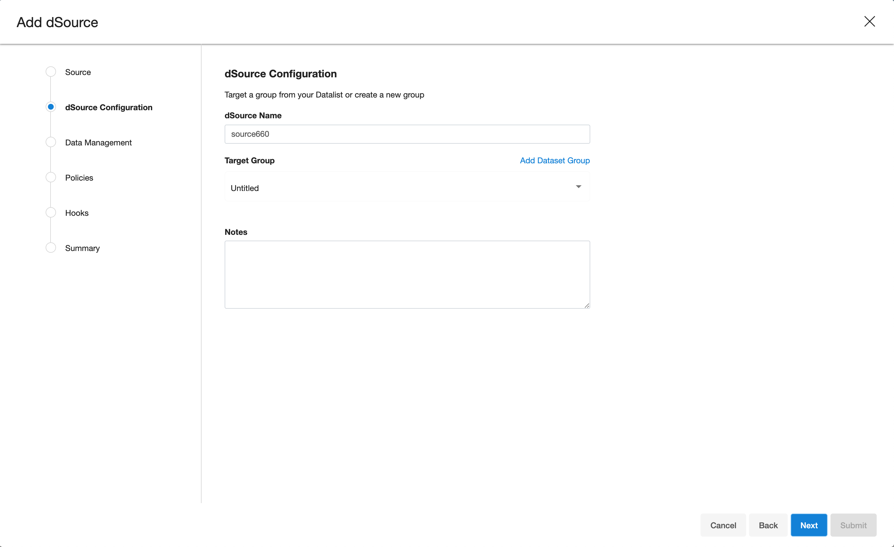

20. On the **Data management** page, select the following:
    - Staging Environment: This will be your staging host where source config was created.
    - User: Database OS user with required privileges for linking the dataset.

    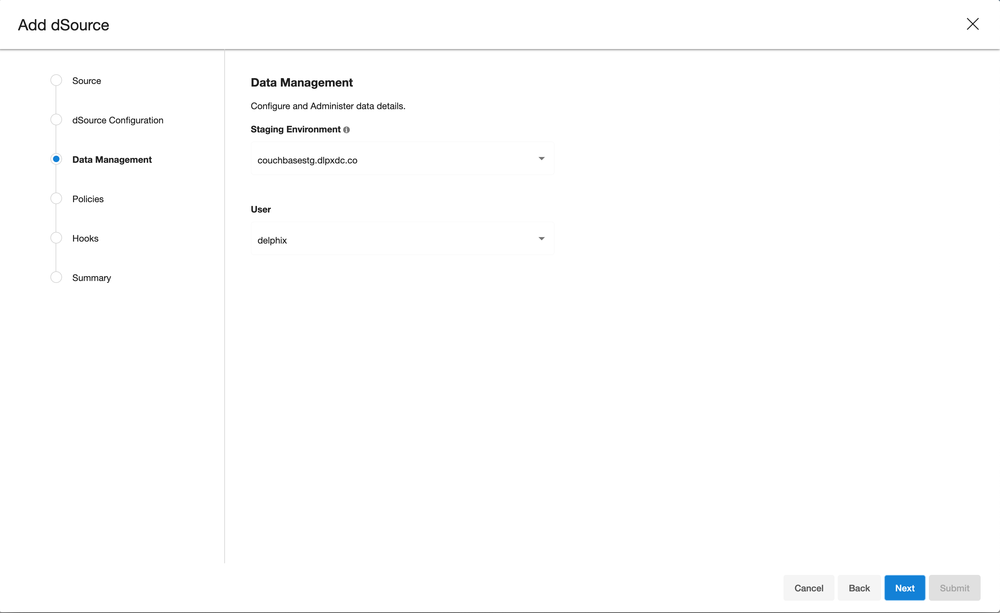

21. On the next screens, configure a policy, hooks and review the configuration and click on **Next** button to view the summary.

    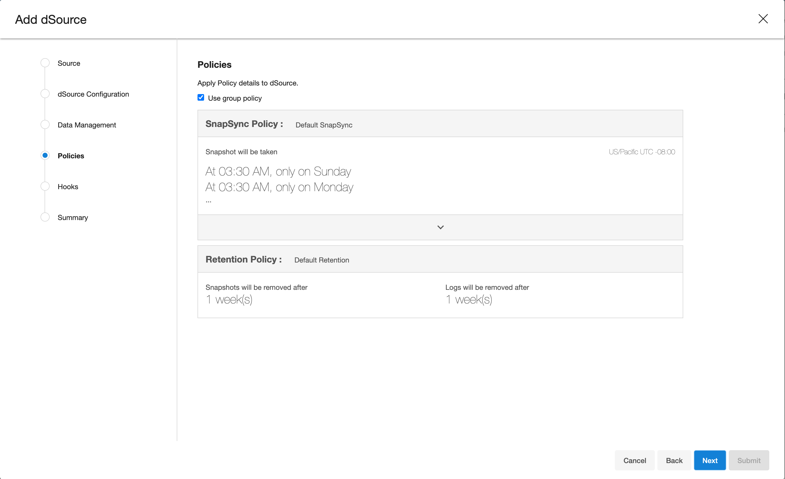

    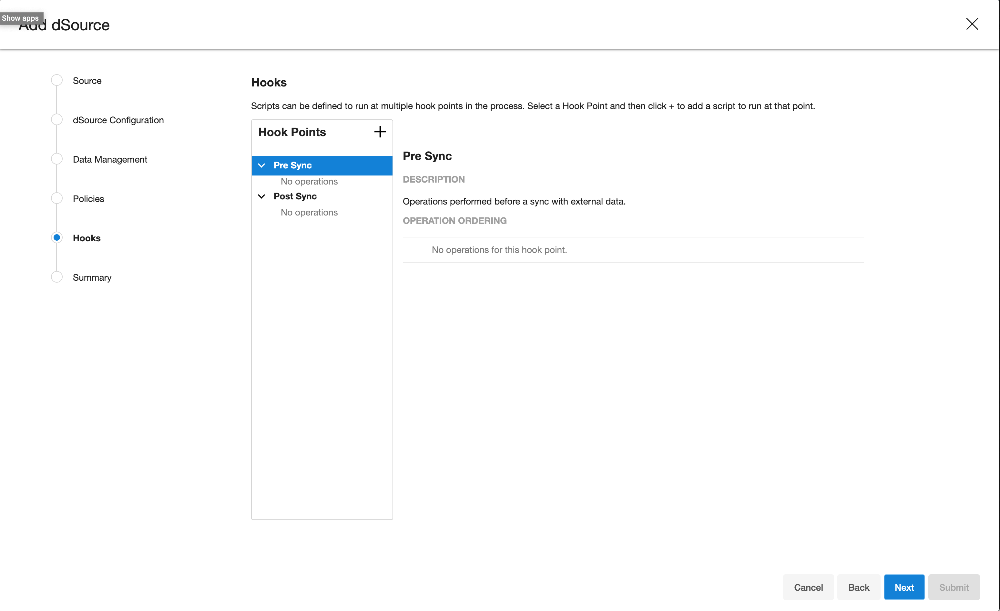


20. Click the **Submit** button which will initiate the linking process.

    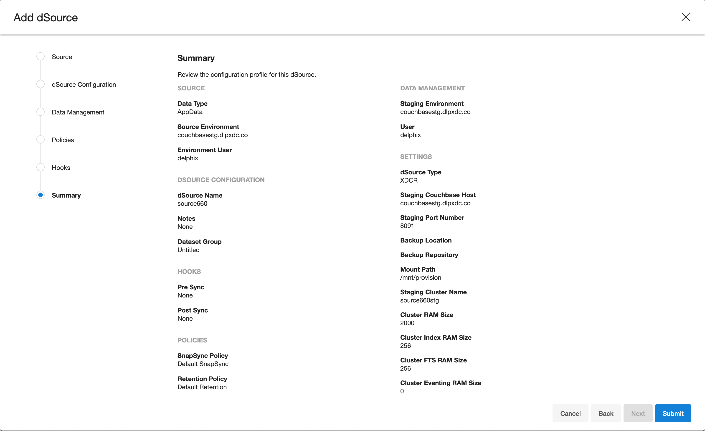


21. Once dSource is created successfully, you can review the datasets on **Manage** > **Datasets** > **dSource Name**.  


     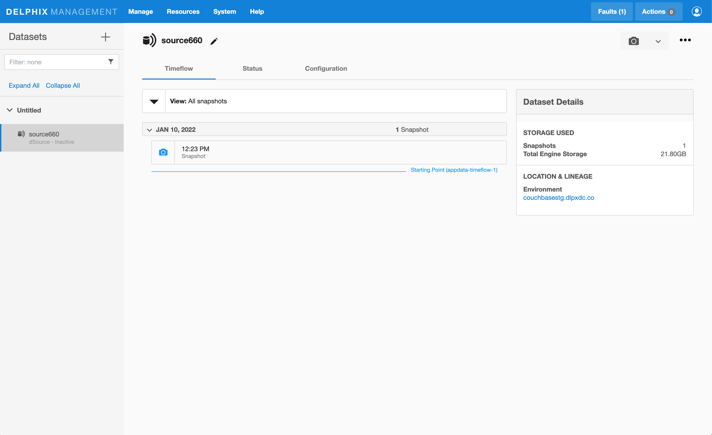


## Creating dSource using backup

Prerequisites:
Access to production backup with those ex. values:

/backup - archive

PROD - repository

```
 /opt/couchbase/bin/cbbackupmgr info -a /backup -r PROD
 Name  | Size     | # Backups  |
 PROD  | 58.03MB  | 1          |
 +  Backup                               | Size     | Type  | Source                              | Cluster UUID                      | Range  | Events  | Aliases  | Complete  |
 +  2022-01-10T11_29_26.465860528-05_00  | 58.03MB  | FULL  | http://couchbasesrc.dlpxdc.co:8091  | 08f7937a26b2d20178a5ed16d7a2dd1c  | N/A    | 0       | 0        | true      |
```


1. Login to **Delphix Management** application.
2. Click **Manage** >  **Datasets**.
3. Select **Add dSource**.
4. In the Add dSource wizard, select the Couchbase source configuration which is created on the staging host.
5. Enter the Couchbase-specific parameters for your dSource configuration.
6. Select the dSource type Couchbase Backup Manager from the drop-down available on dSource wizard.
7. Based on approach selection, follow the steps either for XDCR or Couchbase Backup Manager method. The Description of both methods is below.
8. Enter the details for **Staging Couchbase host** - FQDN or IP address recommended.
9. Enter the details for **Staging Port Number** available on the staging host. The default port for couchbase is 8091.
10. Enter the details for **Backup Location** available on the staging host.  For instance, if your Backup Path is specified as "/u01/couchbase/backups/," the corresponding **Backup Location** should be set as "/u01/couchbase".
11. Enter the details for **Backup Archive Name**. 
    - If Backup Path is specified as "/u01/couchbase/backups/," the corresponding **Backup Archive Name** should be set as "backups".
    - If the **Backup Archive Name** field left empty then it will automatically ingest new full backups. The plugin will search for backup folders in the format %Y%m%d%H%M%S within **Backup Location**.
12. Enter the details for **Backup repository** 
13. Enter the details for **Mount Path** available on the staging host. This empty folder acts as a base for NFS mounts.
14. Enter the details for **Staging Cluster Name** to setup new cluster on the staging host.
15. Enter the configuration details for your staging cluster as per resource availability on the staging host.
    - Cluster RAM Size
    - Cluster Index RAM Size
    - Cluster FTS RAM Size
    - Cluster Eventing RAM Size - this should be 0
    - Cluster Analysis RAM Size - this should be 0    

    

16. Configure the bucket size as an array.  
    - If "bucket_name" is set to "*", and "bucket_size" is assigned a numeric value, all buckets should be configured with the specified size.
    - When both "bucket_name" and "bucket_size" are provided with specific values, individual buckets should be configured according to the corresponding values.

      
    
17. Enter the details of **Bucket Name** and **Bucket Size (in MB)**. Size must be greater than or equals to 100MB. 

    
18. Enter the details for **Staging Cluster Admin User**  and **Staging Cluster Admin Password**
19. Enter dummy values for **Source Cluster Admin User**  and **Source Cluster Admin Password** - they are not used

    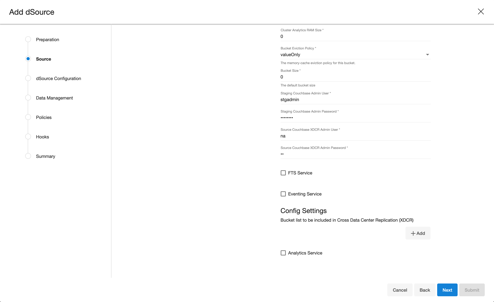

20. Then click on **Next** button  

21. Provide the details for **dSource Name** and **Target group** on the dSource configuration page.  
    

22. On the **Data management** page, select the following:
    - Staging Environment: This will be your staging host where source config was created.
    - User: Database OS user with required privileges for linking the dataset.

    

23. On the next screens, configure a policy, hooks and review the configuration and click on **Next** button to view the summary.

    

    


20. Click the **Submit** button which will initiate the linking process.

    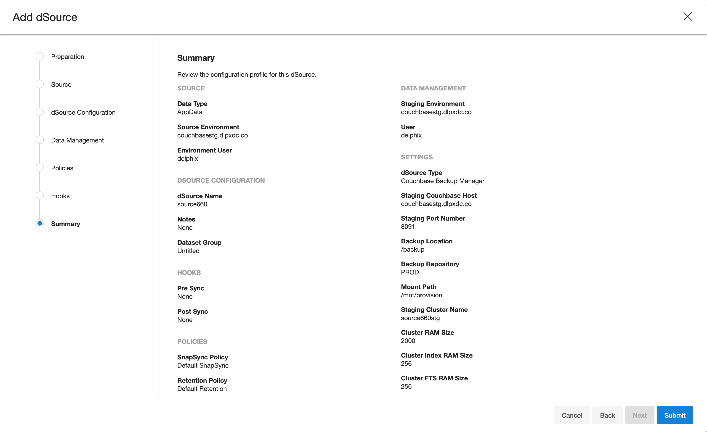


21. Once dSource is created successfully, you can review the datasets on **Manage** > **Datasets** > **dSource Name**.  


     

