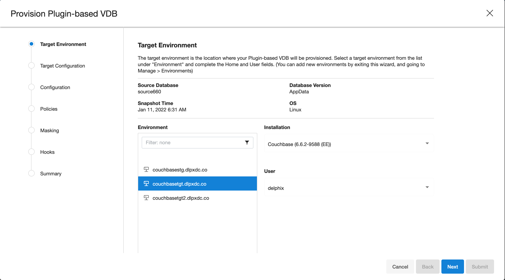
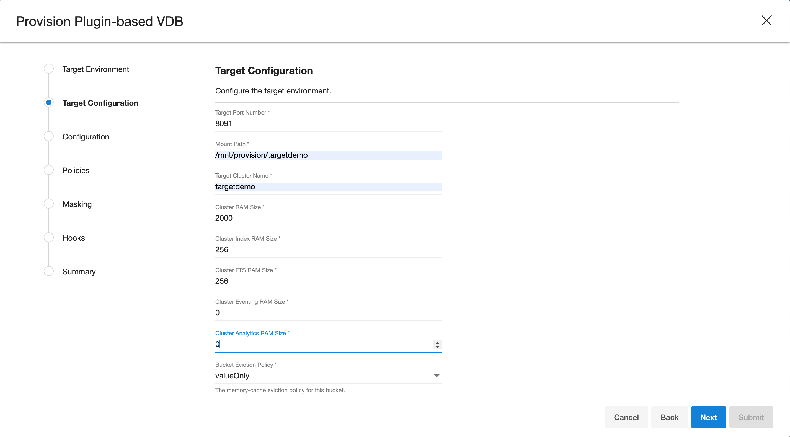
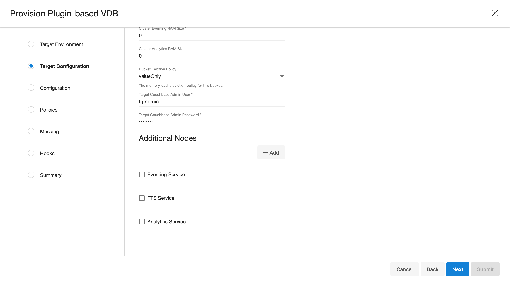
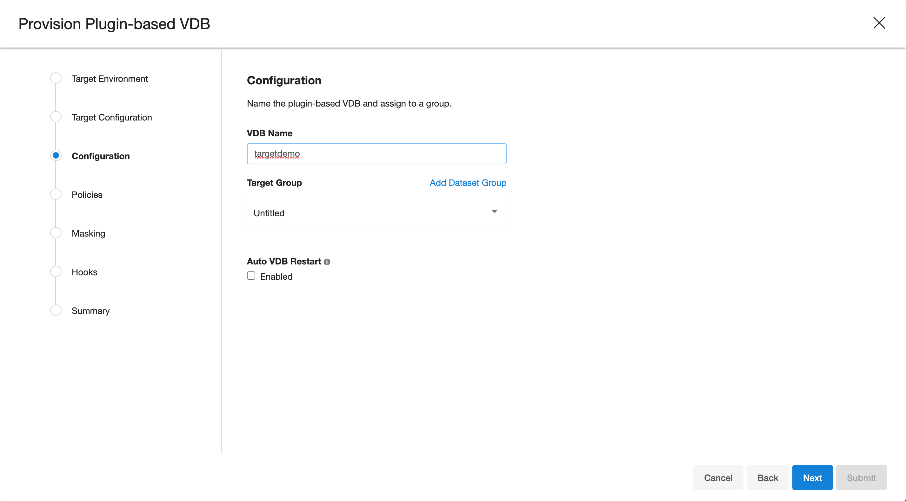
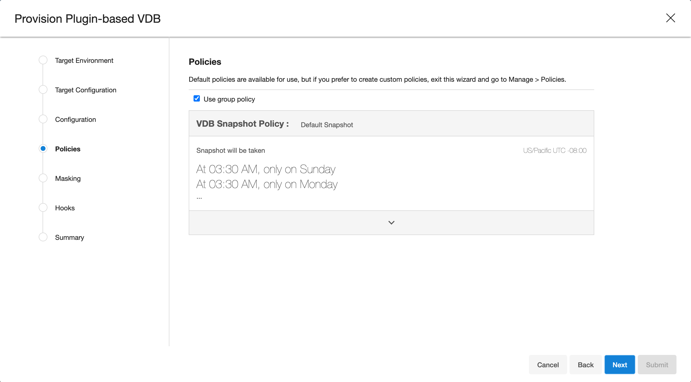
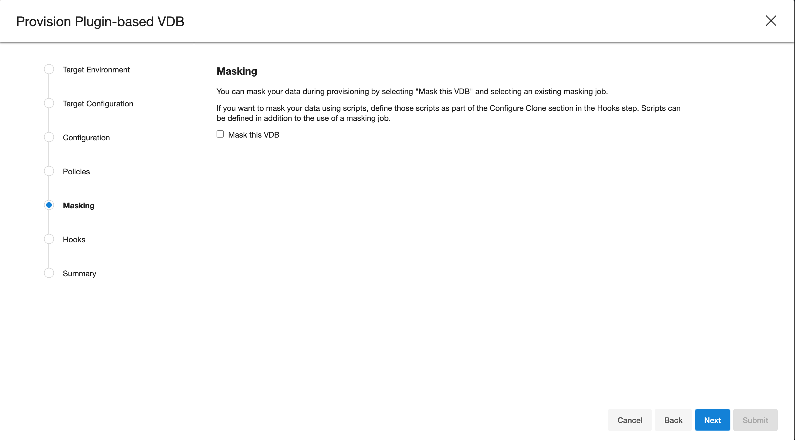
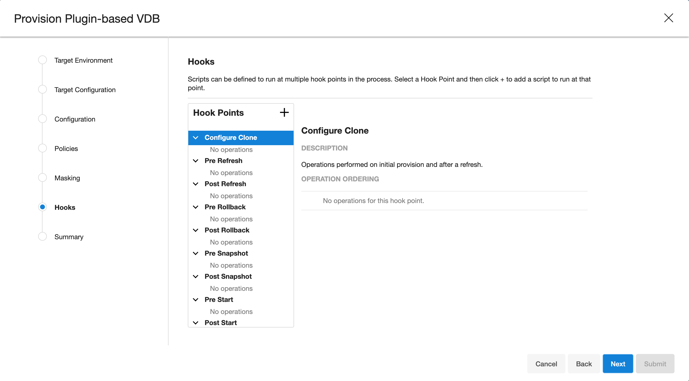
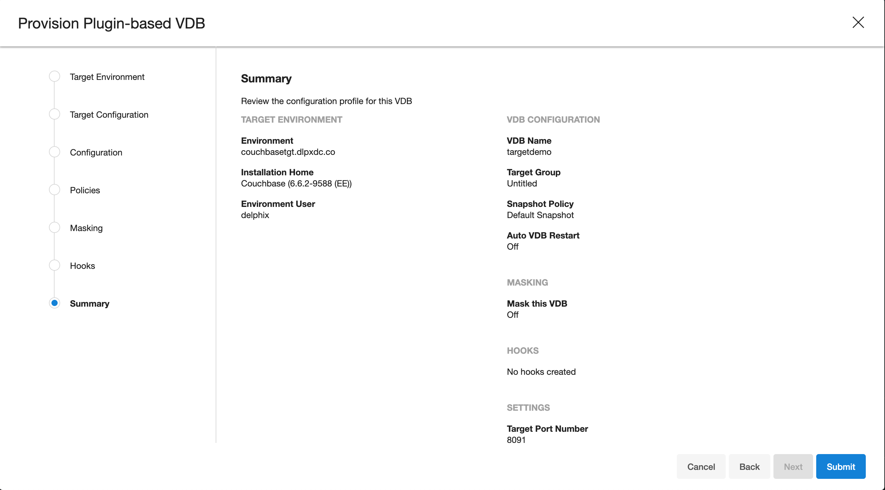
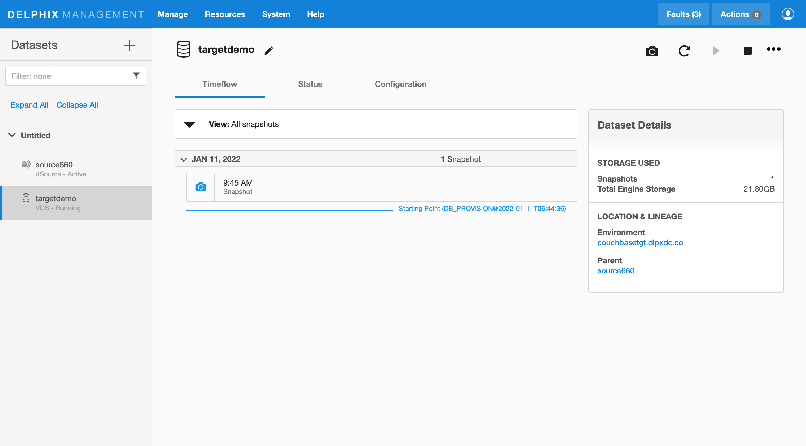
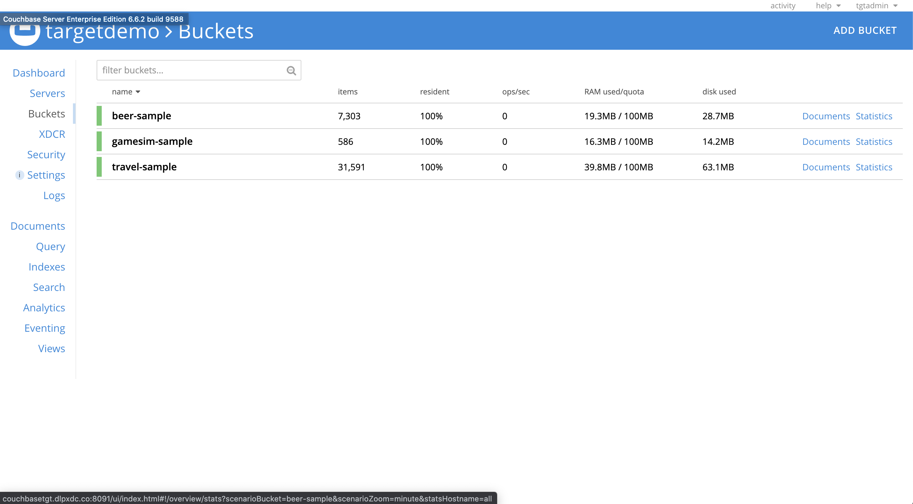

# Provisioning

Virtual databases are a virtualized copies of dSource. 

## Prerequisites

-   Required a linked dSource from a source host.
-   All prerequisites configured on target environments
-   Added compatible target environment on Delphix Engine 

## Provisioning a VDB

1. Start a provisioning wizard  

2. Select the target host from the dropdown on which VDB needs to be created.  
   

3. Enter the following values for the target configuration:
    - **Target Port Number**: Port number on which Couchbase services will be started. ( ex. 8091 )
    - **Mount Path**: NFS mount path where dSource snapshot will be mounted by Engine ( ex. /mnt/provision/targetdemo )
    - **Target Cluster name**: Cluster name which is required to be set up on the target host. ( ex. targetdemo )
    - **Cluster Ram Size**: Whole Cluster memory
    - **Cluster Index Ram Size**: Cluster indexer memory
    - **Cluster FTS Ram Size**: Cluster FTS memory ( if needed and FTS service will be configured )
    - **Cluster Eventing Ram Size**: Cluster Eventing memory ( if needed and Eventing service will be configured )
    - **Cluster Analytics Ram Size**: Cluster Analytics memory ( if needed and Analytics service will be configured )

    

4. Enter the following values for the target configuration:
    - **Target couchbase Admin User**: Target Cluster admin username 
    - **Target couchbase Admin password**: Target Cluster admin password
    - Select services needed on the target cluster ( FTS, Eventing, Analytics )

    

5. Provision plugin based VDB. Enter the follwing value:
    - **VDB Name**: Delphix Target Cluster name
    - **Target group**: Delphix Target Cluster group
    

5. Select a policy for VDB, select **Next**.
    

6. Select masking for VDB if needed, select **Next**
    

7. Add hooks for VDB if needed, select **Next**
   

8. Preview the summary and select **Submit**
   

9. Once the VDB is created successfully, you can review the datasets on **Manage** > **Datasets** > **vdb Name**.
   

## Accesssing Target VDB Cluster

Use a IP / Hostname of the target environment and VDB port defined above to access Target Cluster VDB.
Admin user name and password are defined based on input from point 4.

