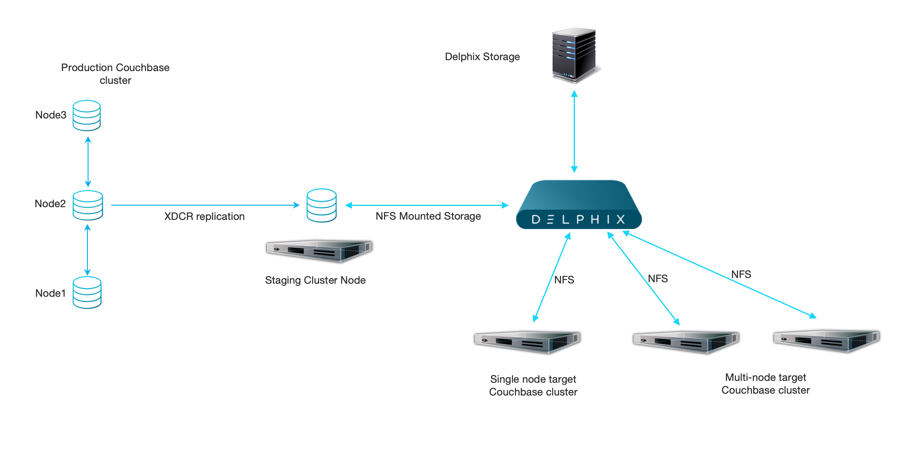
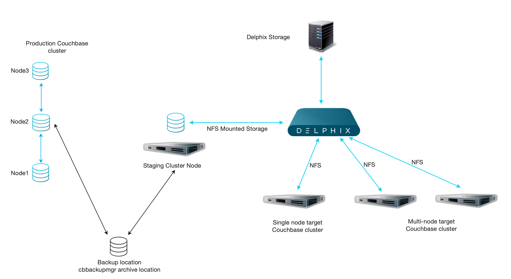

<html>
 <head>

 </head>
</html>

# Overview

Couchbase plugin is developed to virtualize Couchbase data source. The ingestion (synchronization process) leveraging the following built-in Couchbase technologies
depends on the Couchbase Edition:

- Community Edition:
    - Cross Data Center Replication (XDCR)

- Enterprise Edition:
    - existing backup manged by `cbbackupmgr` tool (Zero production touch ingestion)
    - Cross Data Center Replication (XDCR)

### Cross Data Center Replication (XDCR)

Cross Data Center Replication is a method to replicate date between source and target bucket. Plugin is automatically setting up an one way replication
from a production Couchbase cluster to a staging Couchbase cluster created by Delphix Enging during a dSource ingestion.
Replication to staging server will be added to the existing list of replication and it will be managed by plugin itself.

[link to official XDCR documentation](https://docs.couchbase.com/server/current/learn/clusters-and-availability/xdcr-overview.html)

### Exiting backup ingestion ( `cbbackupmgr` )

Couchbase Enterprise Edition is providing an additional tool called `cbbackupmgr`.
This tool can be leveraged to protect a production Couchbase cluster and an existing backup
will be used to create a staging server. This method allow cloning a production Couchbase cluster
without touching a production server by Delphix Engine nor staging server. In zero production touch
setup staging server has to have access to cbbackupmgr archive folder and repository.

[link to official cbbackupmgr documentation](https://docs.couchbase.com/server/6.6/backup-restore/backup-restore.html)

# Architecture diagrams

### Ingestion using XDCR

### Ingestion using backup

       
  

    

